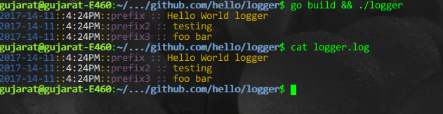
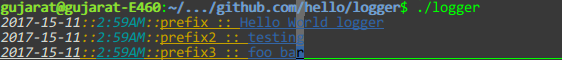

# Logger
A very simple logger for debugging purposes.

## Installation
Make sure you have setup Go in your environtment 

```shell
go get github.com/gujarats/logger
```

## Usage
It is very simple you can just call it : 

```go
logger.Debug("prefix :: ", "Hello World logger")
logger.Debug("prefix2 :: ", "testing")
logger.Debug("prefix3 :: ", "foo bar")
```
This will output

[]()

That's it. it would print the log message with specific format time. And save it to a `logger,log` file

## Customize color
You can also set color as you like : 

```go
func init() {
	debugStyle := logger.DebugStyle{
		PrefixColor:  logger.Yellow,
		MessageColor: logger.Blue,
		Style:        logger.Underline,
	}

	timeStyle := logger.TimeStyle{
		YearColor: logger.White,
		SepColor:  logger.Yellow,
		DateColor: logger.Cyan,
		Style:     logger.Italic,
	}
	logger.NewCustomColor(debugStyle, timeStyle)
}

// you can call it anywhere direcly 
logger.Debug("prefix :: ", "Hello World logger")
```

[]()
